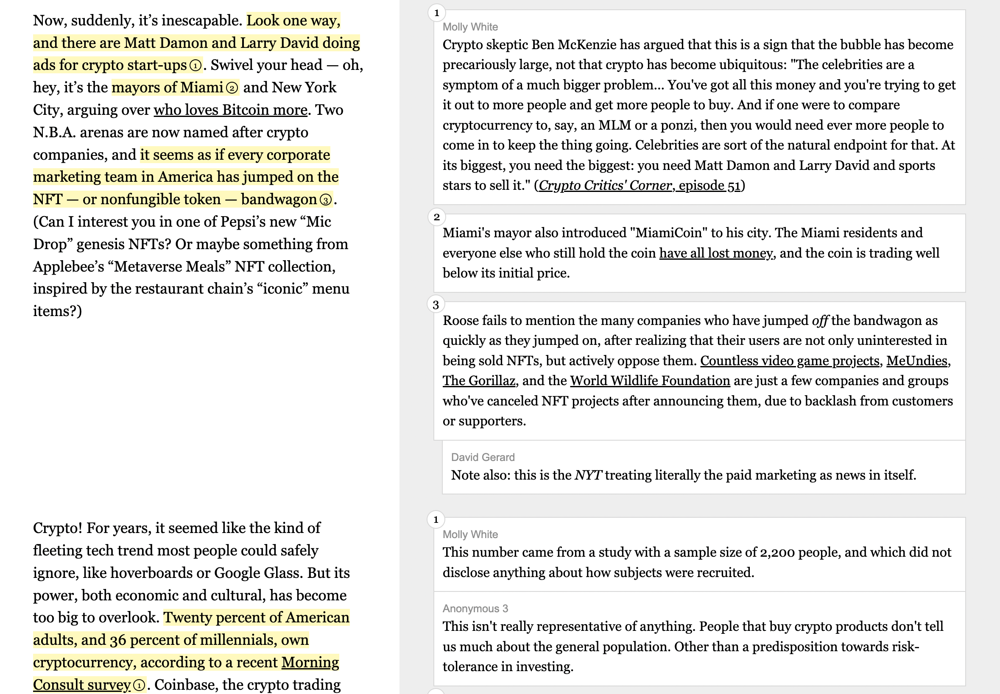

# Annotate

Annotate and publish text on the web! This project was created for ["The (Edited) Latecomer's Guide to Crypto"](https://www.mollywhite.net/annotations/latecomers-guide-to-crypto), but can be used to annotate any text document.



## How to use
Copy the `index.html`, `styles.css`, and `annotate.js` files to your project. You should only need to edit the `index.html` file, unless you want to change the styling or JavaScript behavior. This project does not *require* the JavaScript, so if you want to leave it out, just omit the `annotate.js` file and remove the `<script src="./annotate.js"></script>` tag from the HTML file. The `screenshots` folder has full-size screenshots of the index page in both desktop ([`index-desktop.png`](https://github.com/molly/annotate/blob/main/screenshots/index-desktop.png)) and mobile ([`index-mobile.png`](https://github.com/molly/annotate/blob/main/screenshots/index-mobile.png)) views, so you can see what the HTML produces.

The demo folder contains the HTML for the entire ["(Edited) Latecomer's Guide to Crypto"](https://www.mollywhite.net/annotations/latecomers-guide-to-crypto), if you're trying to replicate anything there.

Each section of the document follows this basic structure:

```html
<div class="group">
  <div class="left">
    <div class="content">
      Text that's being <mark data-annotation-id="1" aria-details="unique-comment-id">annotated</mark>.
    </div>
  </div>
  <div class="right">
    <div class="content">
      <div class="annotation" role="comment" data-annotation-id="1" id="unique-comment-id">
        <div class="commenter">Commenter name</div>
        Comment text.
      </div>
    </div>
  </div>
</div>
```

and produces:


## Details

Each section of text is captured in a row with left- and right-hand sections. The div with the `group` class represents this row. Each side then has a div with the `left` or `right` class, which has a child `content` div.

Each portion of highlighted text in the original source (left-hand side) is marked with `<mark>` tags. These must have a unique `aria-details` attribute that will correspond to the `id` of the annotation, which will enable visual focus highlighting on click. It can also optionally have a `data-annotation-id` to number the annotation, to help distinguish annotations when there are multiple in a section.

Corresponding to the `<mark>` tag will be a div with either the `annotation` or `annotation-group` class on the right-hand side (the former for single annotations, the latter for grouped annotations). These must have `role="comment"` and an `id` that exactly matches the unique `aria-details` value of the highlighted text to which it corresponds. As with the highlighted text, it can have a `data-annotation-id` to number the annotation.

### Grouped annotations
Within an annotation group, there will be one or more divs with the `annotation` class. These can contain a div with the class `commenter` to identify the writer, if there are multiple annotators working on the document. These do *not* need `role="comment`, `data-annotation-id`, or `id` since they're nested within an `annotation-group` with those attributes.

In the case of multiple annotations within an annotation group, they can appear directly stacked, or threaded (rendering with increasing levels of indentation, to indicate that they are replies to one another). To thread comments, include the `thread` class on the second comment (the first reply). Any subsequent replies should be marked with the `thread-x` class, where `x` is the level of indentation from 2–10: `thread-2`, `thread-3`, ..., `thread-10`. Omit the `thread` classes to render multiple annotations in a stack without indentation.

```html
<div class="group">
  <div class="left">
    <div class="content">
      Text that's being <mark data-annotation-id="1" aria-details="unique-comment-id">annotated</mark>.
    </div>
  </div>
  <div class="right">
    <div class="content">
      <div class="annotation-group" role="comment" data-annotation-id="1" id="unique-comment-id">
        <div class="annotation">
          A comment with indented responses.
        </div>
        <div class="annotation thread"> 
          A reply
        </div>
        <div class="annotation thread-2"> 
          A second reply
        </div>
      </div>
    </div>
  </div>
</div>
```


## Other source formats

The original Latecomer's Guide project was created using [Pug](https://pugjs.org/) and [Sass](https://sass-lang.com). If you'd rather work with those, that source code lives over with my [website source](https://github.com/molly/website-v2):
* [Pug](https://github.com/molly/website-v2/blob/master/src/pug/pages/annotations/latecomers-guide-to-crypto.pug) file
* [Sass](https://github.com/molly/website-v2/blob/master/src/sass/reviews.sass) file

## Mobile display

This is how the annotations display on mobile:


